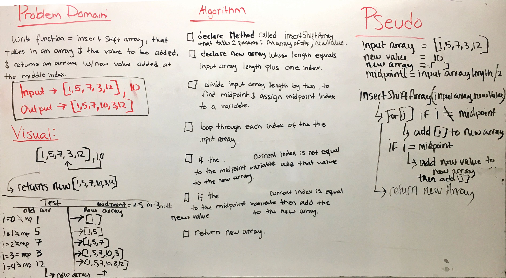
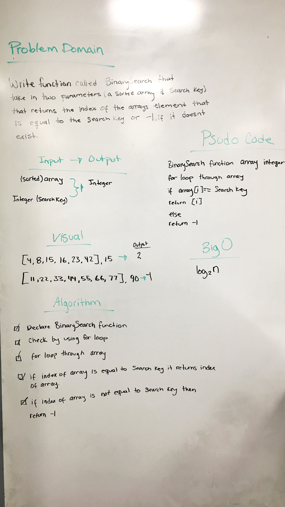
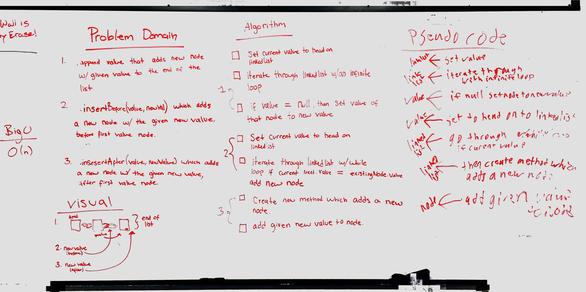
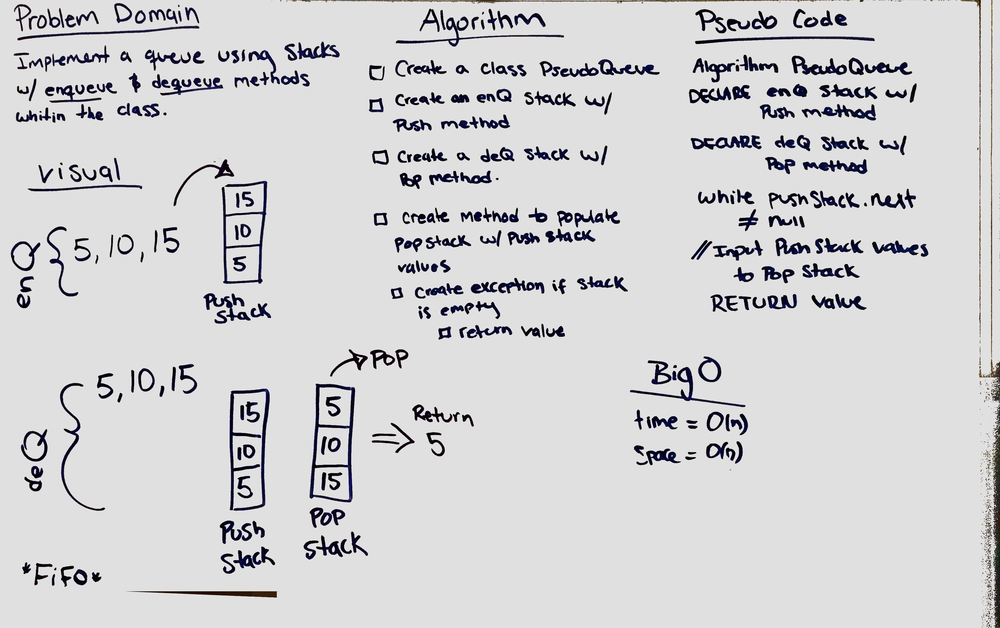
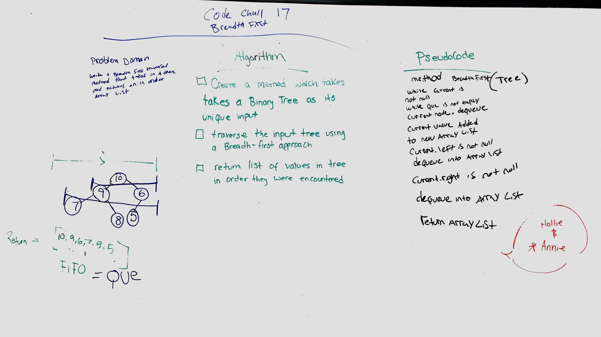

Array Shift (code challenge 02)

# Insert and shift an array in middle at index
Write a function that equals insert shift array, that takes in an array and the value to be added, and returns an
array with new value added at the middle index. 

## Challenge
Write a function called insertShiftArray which takes in an array and the value to be added. Without utilizing any of
the built-in methods available to your language, return an array with the new value added at the middle index.

## Approach & Efficiency
<!-- What approach did you take? Why? What is the Big O space/time for this approach? -->

## Solution

Binary Search (code challenge 03)

# Binary search in a sorted 1D array
Write a function called BinarySearch which takes in 2 parameters: a sorted array and the search key. Without utilizing 
any of the built-in methods available to your language, return the index of the array’s element that is equal to the 
search key, or -1 if the element does not exist. 

## Challenge
Write a function called BinarySearch which takes in 2 parameters: a sorted array and the search key. Without utilizing 
any of the built-in methods available to your language, return the index of the array’s element that is equal to the 
search key, or -1 if the element does not exist.

## Approach & Efficiency
<!-- What approach did you take? Why? What is the Big O space/time for this approach? -->

## Solution

Linked List (code challenge 06)

- [ ] Top-level README “Table of Contents” is updated
 - [ ] Feature tasks for this challenge are completed
 - [ ] Unit tests written and passing
     - [ ] “Happy Path” - Expected outcome
     - [ ] Expected failure
     - [ ] Edge Case (if applicable/obvious)
 - [ ] README for this challenge is complete
     - [ ] Summary, Description, Approach & Efficiency, Solution
     - [ ] Link to code **Need to add**
     - [ ] Picture of whiteboard
     
     
     

# Implementation: Stacks and Queues 
### (code challenge/lab 10)

   - [ ] Summary/Description: Create a Node class that has properties for the value stored in the Node, 
        and a pointer to the next node.
         Create a Stack class that has a top property. It creates an empty Stack when instantiated.
         This object should be aware of a default empty value assigned to top when the stack is created.
         
         Define a method called push which takes any value as an argument and adds a new node with that 
         value to the top of the stack with an O(1) Time performance.
         
         Define a method called pop that does not take any argument, removes the node from the top of the 
         stack, and returns the node’s value.
        
         Define a method called peek that does not take an argument and returns the value of the node 
         located on top of the stack, without removing it from the stack.
         
         Define a method called isEmpty that does not take an argument, and returns a boolean indicating 
         whether or not the stack is empty.
        
         Create a Queue class that has a front property. It creates an empty Queue when instantiated.
         This object should be aware of a default empty value assigned to front when the queue is created.
        
         Define a method called enqueue which takes any value as an argument and adds a new node with that 
         value to the back of the queue with an O(1) Time performance.
        
         Define a method called dequeue that does not take any argument, removes the node from the front of 
         the queue, and returns the node’s value.
         
         Define a method called peek that does not take an argument and returns the value of the node 
         located in the front of the queue, without removing it from the queue.
       
         Define a method called isEmpty that does not take an argument, and returns a boolean indicating 
         whether or not the queue is empty.
   - [ ] Efficiency: O(n)
   - [ ] Link to code: **Need to add**
 
     
# Implement a Queue using two Stacks 
### (code challenge 11)

   - [ ] Summary: Created a queue with two stacks.
   - [ ] Description: Create a brand new PseudoQueue class. Do not use an existing Queue. Instead, this PseudoQueue 
   class will implement our standard queue interface (the two methods listed below), but will internally only utilize 
   2 Stack objects. Ensure that you create your class with the following methods:
               
     enqueue(value) which inserts value into the PseudoQueue, using a first-in, first-out approach.
     dequeue() which extracts a value from the PseudoQueue, using a first-in, first-out approach.
     The Stack instances have only push, pop, and peek methods. You should use your own Stack implementation. 
     Instantiate these Stack objects in your PseudoQueue constructor.
   - [ ] Efficiency: O(1)
   - [ ] Link to code: **Need to add**
   - [ ] Picture of whiteboard:
     
     
     
     
# Multi-bracket Validation 
### (code challenge 13)

   - [ ] Summary: Created a queue with two stacks.
   - [ ] Description: Your function should take a string as its only argument, and should return a boolean representing whether or not the brackets in the string are balanced. There are 3 types of brackets:
                      
                      Round Brackets : ()
                      Square Brackets : []
                      Curly Brackets : {}
   - [ ] Approach:
   - [ ] Efficiency: O(1)
   - [ ] Solution:
   - [ ] Link to code: **Need to add**
   - [ ] Picture of whiteboard:
   
   
   
   

# Binary Tree and BST 
### (code challenge/lab 15)

   - [ ] Summary:  Binary Tree and BST 
   - [ ] Description:    Create a Node class that has properties for the value stored in the node, the left child node, 
                         and the right child node.
                         
                         Create a BinaryTree class
                         Define a method for each of the depth first traversals called preOrder, inOrder, and postOrder 
                         which returns an array of the values, ordered appropriately.
                         
                         Any exceptions or errors that come from your code should be semantic, capturable errors. 
                         For example, rather than a default error thrown by your language, your code should raise/throw 
                         a custom, semantic error that describes what went wrong in calling the methods you wrote for 
                         this lab.
                         
                         Create a BinarySearchTree class
                         Define a method named add that accepts a value, and adds a new node with that value in the 
                         correct location in the binary search tree.
                         Define a method named contains that accepts a value, and returns a boolean indicating whether 
                         or not the value is in the tree at least once.
   - [ ] Efficiency: 
   - [ ] Solution:
   - [ ] Link to code: **Need to add**
 
 
 
 
  # FizzBuzz 
  ### (code challenge/lab 16 & 17)
  
   - [ ] Summary:  Binary Tree and BST 
   - [ ] Description: Write a function called FizzBuzzTree which takes a tree as an argument.
                      Without utilizing any of the built-in methods available to your language, determine whether 
                      or not the value of each node is divisible by 3, 5 or both. Create a new tree with the same 
                      structure as the original, but the values modified as follows:
                          
                      If the value is divisible by 3, replace the value with “Fizz”
                      If the value is divisible by 5, replace the value with “Buzz”
                      If the value is divisible by 3 and 5, replace the value with “FizzBuzz”
                      If the value is not divisible by 3 or 5, simply turn the number into a String.
   - [ ] Efficiency: 
   - [ ] Solution:
   - [ ] Link to code: **Need to add**
   - [ ] Picture of whiteboard:
   
   
   
   
   # Breadth-First Traversal 
   ### (code challenge 17)
     
   - [ ] Summary:  Binary Tree and BST 
   - [ ] Description:Write a breadth first traversal method which takes a Binary Tree as its unique input. 
          Without utilizing any of the built-in methods available to your language, traverse the input tree using a 
          Breadth-first approach, and return a list of the values in the tree in the order they were encountered.
   - [ ] Efficiency: 
   - [ ] Solution:
   - [ ] Link to code: **Need to add**
   - [ ] Picture of whiteboard:
      
   
   
   
   
